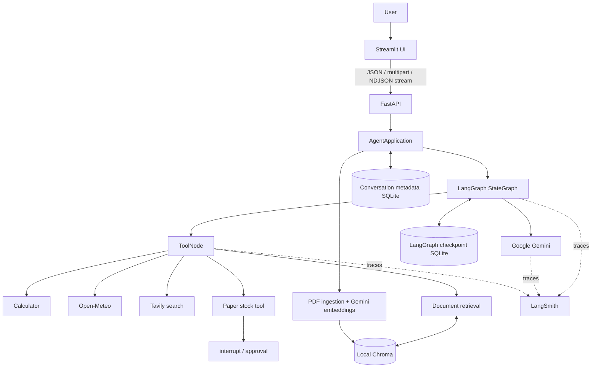

# Agentic AI Chatbot

An educational, single-agent chatbot showing how modern agentic systems fit
together. It demonstrates Gemini reasoning and tool selection, an explicit
LangGraph workflow, LangChain integrations, real response streaming, UUID
conversation threads, SQLite persistence, Human-in-the-Loop approval, PDF RAG,
Gemini embeddings, local Chroma vector search, FastAPI, Streamlit, and LangSmith
observability.

Streamlit is only the user interface. It communicates with FastAPI over HTTP and
never imports or calls Gemini, LangGraph, Chroma, or either SQLite store.

This project never connects to a brokerage, places real orders, or uses real
money.

## Requirements

- Python 3.12 or newer
- [`uv`](https://docs.astral.sh/uv/)

## Setup

From a clean clone, install `uv`, create the environment, and install the locked
dependencies:

```bash
curl -LsSf https://astral.sh/uv/install.sh | sh
git clone <repository-url>
cd agentic-chatbot
uv sync --all-groups
```

Copy the environment template:

```bash
cp .env.example .env
```

Add your Google AI Studio key. Add Tavily when you want web search:

```dotenv
GOOGLE_API_KEY=your-google-api-key
TAVILY_API_KEY=your-tavily-api-key
BACKEND_API_URL=http://127.0.0.1:8000
```

Do not commit `.env`; it is ignored by Git.

## Run the finished application

Start FastAPI in the first terminal:

```bash
uv run uvicorn agentic_chatbot.api:app --reload
```

Start Streamlit in the second terminal:

```bash
uv run streamlit run src/agentic_chatbot/streamlit_app.py
```

Open `http://localhost:8501`. FastAPI documentation remains available at
`http://127.0.0.1:8000/docs`.

The Streamlit sidebar creates and reopens backend conversations, renames or
deletes them, and uploads/lists conversation-scoped PDFs. The main panel loads
persisted history, streams new answers, shows brief tool activity, displays
filename/page sources when present, and presents approval controls for pending
paper trades. Streamlit session state stores only UI selections; FastAPI remains
the source of truth.

## Optional CLI

Start a new conversation:

```bash
uv run agentic-chatbot
```

The application creates and displays a UUID:

```text
Gemini chatbot ready. Type 'exit' or 'quit' to stop.
Conversation ID: 7d91f4eb-276f-4a24-bb27-c5ee0b1b8f9e
You:
```

Save that ID. To continue the same conversation after restarting:

```bash
uv run agentic-chatbot --thread-id 7d91f4eb-276f-4a24-bb27-c5ee0b1b8f9e
```

Omitting `--thread-id` always creates a fresh conversation UUID. Its initial
title is generated from the first user message by collapsing whitespace and
truncating it to 60 characters; this does not require an extra model call.

Manage saved conversations without starting Gemini:

```bash
uv run agentic-chatbot --list-conversations
uv run agentic-chatbot --rename 7d91f4eb-276f-4a24-bb27-c5ee0b1b8f9e "LangGraph lesson"
uv run agentic-chatbot --delete 7d91f4eb-276f-4a24-bb27-c5ee0b1b8f9e
```

`--list-conversations` prints the UUID, title, and last-updated timestamp.
Deleting removes the metadata record and asks the LangGraph checkpointer to
delete that thread through its public API.

Ingest and inspect PDFs associated with a conversation:

```bash
THREAD_ID="paste-the-conversation-uuid"
uv run agentic-chatbot --thread-id "$THREAD_ID" --ingest-pdf ./documents/guide.pdf
uv run agentic-chatbot --thread-id "$THREAD_ID" --list-documents
uv run agentic-chatbot --thread-id "$THREAD_ID"
```

PDF ingestion uses the Gemini API to generate embeddings. `PyPDFLoader` extracts
embedded text; image-only scanned PDFs require OCR, which is not implemented.

You can also run the package as a module:

```bash
uv run python -m agentic_chatbot
```

### Run the HTTP API

Start the development server:

```bash
uv run uvicorn agentic_chatbot.api:app --reload
```

Open `http://127.0.0.1:8000/docs` for interactive Swagger UI documentation or
`http://127.0.0.1:8000/redoc` for ReDoc. The OpenAPI schema is available at
`http://127.0.0.1:8000/openapi.json`.

All application endpoints are under `/api`:

| Method | Path | Purpose |
| --- | --- | --- |
| `GET` | `/api/health` | Check that the API is running |
| `POST` | `/api/conversations` | Create a UUID conversation |
| `GET` | `/api/conversations` | List conversation metadata |
| `GET` | `/api/conversations/{thread_id}` | Get conversation metadata |
| `PATCH` | `/api/conversations/{thread_id}` | Rename a conversation |
| `DELETE` | `/api/conversations/{thread_id}` | Delete a conversation and its supported persisted data |
| `POST` | `/api/conversations/{thread_id}/messages` | Run one message through LangGraph |
| `POST` | `/api/conversations/{thread_id}/messages/stream` | Stream one message as NDJSON events |
| `GET` | `/api/conversations/{thread_id}/state` | Read visible history and pending approval |
| `POST` | `/api/conversations/{thread_id}/documents` | Upload and ingest one PDF |
| `GET` | `/api/conversations/{thread_id}/documents` | List PDFs for the conversation |
| `POST` | `/api/conversations/{thread_id}/approval` | Approve or reject a pending paper trade |

The original `/messages` endpoint remains available for clients that prefer one
completed JSON response. `/messages/stream` performs real end-to-end streaming
and returns `application/x-ndjson`.

## Test

```bash
uv run pytest
```

## Project layout

```text
src/agentic_chatbot/
├── streamlit_app.py   # UI; calls FastAPI only
├── api_client.py      # typed HTTP/NDJSON client for Streamlit
├── ui_state.py        # testable UI stream and citation helpers
├── api.py             # FastAPI routes and StreamingResponse
├── api_models.py      # request/response schemas
├── application.py     # coordinates existing backend services
├── graph.py           # explicit StateGraph and agent/tool loop
├── streaming.py       # safe LangGraph stream-event adapter
├── conversations.py   # application metadata repository
├── persistence.py     # LangGraph SQLite checkpointer
├── rag.py             # PDF ingestion, embeddings, and Chroma
├── tools/             # calculator, weather, search, RAG, paper trade
├── cli.py             # optional terminal interface
├── main.py            # CLI composition root
└── config.py          # centralized environment settings
data/
├── chroma/                       # PDF vectors; created locally; ignored
├── conversations.sqlite          # app metadata; created locally; ignored
└── langgraph_checkpoints.sqlite  # graph state; created locally; ignored
tests/                              # offline unit and integration tests
```

## Architecture



Streamlit owns presentation and small UI-only session values such as the
currently selected backend UUID. FastAPI owns the HTTP contract. LangGraph owns
agent execution and tool routing. The backend databases and Chroma remain the
sources of truth across UI reruns and process restarts.

### Explicit graph

FastAPI is only the HTTP boundary: it validates JSON, multipart uploads, UUIDs,
and maps expected application errors to HTTP status codes. Route handlers call
`AgentApplication`, which coordinates the existing conversation repository,
LangGraph graph, checkpointer, and RAG service. Agent decisions and tool routing
remain inside LangGraph.

For a message request, the URL's `thread_id` is passed to LangGraph as
`configurable.thread_id`. The SQLite checkpointer restores that thread's state,
Gemini may call tools, and the completed answer or pending interrupt is returned
as JSON. Reusing the same UUID on a later HTTP request restores the same graph
state—even after the API process restarts.

The streaming route passes each safe event onward immediately instead of
waiting for the entire graph run to finish.

```text
                     no tool call
                  ┌──────────────→ END
                  │
START ──→ agent/model node
                  │
                  │ tool call requested
                  ▼
              tools node
                  │
                  └──────────────→ agent/model node
                                      (interprets tool result)
```

The graph is assembled directly with `StateGraph`, `MessagesState`, `START`,
`END`, conditional edges, `ToolNode`, and `tools_condition`. No prebuilt agent
abstraction is used.

The agent/model node binds all five tool schemas to Gemini. After Gemini replies,
`tools_condition` checks whether its message contains tool calls. Tool calls go to
`ToolNode`; ordinary answers go to `END`. Tool results loop back to Gemini so it
can turn raw data into a natural-language answer.

The graph shape remains explicit. The `paper_buy_stock` tool calls `interrupt()`
before its simulated execution. That
pauses `ToolNode` and stores a structured approval request containing the ticker
and quantity. Harmless tools contain no interrupt and continue immediately.

At compilation, the graph receives a SQLite `SqliteSaver` checkpointer. Every
streamed graph execution also receives this configuration:

```python
{"configurable": {"thread_id": conversation_uuid}}
```

Before a run, the checkpointer loads the latest state for that thread. After graph
steps, it saves new state snapshots. The CLI therefore submits only the newest
human message; LangGraph restores and combines the earlier messages itself.

## Two SQLite databases

`data/langgraph_checkpoints.sqlite` is owned by LangGraph. It contains graph
state such as accumulated messages, pending interrupts, and checkpoint
bookkeeping needed to resume execution. Application code does not inspect or
edit its internal tables.

`data/conversations.sqlite` is owned by this application. Its `conversations`
table contains only `thread_id`, `title`, `created_at`, and `updated_at`. Those
fields support menus and lifecycle actions without treating internal checkpoint
rows as application data.

The same `thread_id` appears in both systems. The metadata record says how to
present a conversation, while the LangGraph checkpoint associated with that ID
restores what was said. When deleting, the application calls the checkpointer's
documented `delete_thread()` method first, then deletes its own metadata; it
never manually manipulates undocumented checkpoint tables.

## PDF ingestion and RAG

```text
PDF
 │
 ▼
PyPDFLoader extracts one document per page
 │
 ▼
RecursiveCharacterTextSplitter creates overlapping chunks
 │
 ▼
Gemini generates an embedding vector for each chunk
 │
 ▼
Local Chroma stores vectors, text, and metadata
```

Every chunk contains `thread_id`, `document_id`, `source_filename`,
`page_number`, and `chunk_index`. Retrieval always applies a `thread_id` filter
inside the tool. The thread is captured when the tool is constructed and is not
an argument Gemini can change.

When Gemini calls `search_documents`, the query is embedded and Chroma returns
the most similar chunks from that conversation only. Results include citation
information such as `guide.pdf, page 3`. Gemini then uses those passages to
compose the answer and cite its sources.

The graph structure is unchanged for streaming. The shared CLI/API adapter
executes it with:

```python
graph.stream(
    {"messages": messages},
    stream_mode=["messages", "updates", "values"],
    version="v2",
)
```

- `messages` events contain `(message_chunk, metadata)` pairs. Text chunks from
  the `agent` node are written immediately to the terminal or HTTP stream.
- `updates` events identify completed graph steps and are translated into safe
  tool lifecycle events containing only the tool name.
- `values` events contain full state snapshots. The last snapshot becomes the
  conversation history for the next user turn.

Metadata filtering ensures only output from the agent/model node is displayed.
Structured tool-call blocks and tool results remain internal. The completed AI
message already exists in the final state, but is not printed again.

## Streaming behavior

For a normal response, text begins appearing as Gemini generates it. For a tool
request, Gemini first emits a structured tool call, so there may initially be no
visible text. The graph runs the tool, loops back to Gemini, and then streams the
final natural-language answer. A short pause during weather or web search is
normal because the external service must finish before Gemini can use its result.

## HTTP streaming protocol

`POST /api/conversations/{thread_id}/messages/stream` accepts the same request as
the non-streaming endpoint:

```json
{"content":"What is 1928 * 73?"}
```

Its response is newline-delimited JSON. Each line is a complete event:

| Event | Fields | Meaning |
| --- | --- | --- |
| `assistant_chunk` | `content` | The next visible piece of Gemini text |
| `tool_started` | `tool` | Gemini requested a named tool |
| `tool_finished` | `tool` | That tool returned to LangGraph |
| `pending_approval` | `approval` | Execution paused for paper-trade approval |
| `complete` | none | The graph run finished normally |
| `error` | `message` | The stream failed after HTTP streaming began |

Tool arguments, tool results, prompts, model objects, and graph state are never
included. An interrupted run emits `pending_approval` instead of `complete`.
Resolve it through the existing `/approval` endpoint.

## Available tools

- `calculator`: parses an allowlist of arithmetic syntax with Python's AST. It
  never uses `eval()` and rejects names, function calls, code, excessive powers,
  non-finite values, and overly large results.
- `get_current_weather`: resolves a location with Open-Meteo's geocoding API and
  returns current temperature, apparent temperature, humidity, condition, and
  wind speed from its forecast API. No weather API key is required.
- `tavily_search`: returns up to five current web-search results. It requires
  `TAVILY_API_KEY`.
- `paper_buy_stock`: proposes a simulated purchase with a ticker and quantity,
  then pauses for explicit approval. Approval returns a paper-only result;
  rejection returns a tool result saying nothing was executed. It has no
  brokerage integration and cannot move money.
- `search_documents`: searches only the PDFs attached to the active conversation
  and returns relevant passages with filename, page number, and document ID.
  Gemini decides when document retrieval is needed.

## Human approval flow

```text
Gemini requests paper_buy_stock
              │
              ▼
       interrupt(payload)
              │
       checkpoint is saved
              │
       approve or reject
              │
              ▼
     Command(resume=decision)
              │
              ▼
 Tool result → Gemini → streamed answer
```

Closing either interface does not resolve an approval. Restart the CLI with the
same `--thread-id`, or reopen that conversation in Streamlit, and the persisted
approval prompt is displayed again.

## Configuration

Configuration is read from environment variables and, when present, a local
`.env` file. See `.env.example` for all supported values. Sensitive values are
represented as secret values and are never written to startup logs.

`GEMINI_MODEL` selects the model and defaults to `gemini-2.5-flash`.
`GEMINI_EMBEDDING_MODEL` selects the PDF embedding model and defaults to
`gemini-embedding-001`.
`LOG_LEVEL` controls this project's logs; routine HTTP-client request logs are
suppressed so they do not interrupt streamed assistant output.
`CHECKPOINT_DB_PATH` selects the local checkpoint file and defaults to
`data/langgraph_checkpoints.sqlite`.
`CONVERSATION_DB_PATH` selects the separate application metadata file and
defaults to `data/conversations.sqlite`.
`CHROMA_DB_PATH` selects the local vector store directory and defaults to
`data/chroma`.
`BACKEND_API_URL` tells Streamlit where FastAPI is running and defaults to
`http://127.0.0.1:8000`.

`GOOGLE_API_KEY` is required for Gemini chat and PDF embeddings.
`TAVILY_API_KEY` is required only for the web-search tool. Open-Meteo does not
require a key. `LANGSMITH_API_KEY` is required only when tracing is enabled.

### LangSmith tracing

To inspect graph and model runs in LangSmith, update `.env`:

```dotenv
LANGSMITH_TRACING=true
LANGSMITH_API_KEY=your-langsmith-api-key
LANGSMITH_PROJECT=agentic-chatbot
LANGSMITH_ENDPOINT=https://api.smith.langchain.com
```

If the API key can access multiple workspaces, also set
`LANGSMITH_WORKSPACE_ID`. With tracing enabled, conversation inputs, outputs,
timings, and execution metadata are sent to LangSmith. Keep tracing disabled for
content you do not want recorded there. LangSmith is the detailed observability
view for model calls, tool calls, graph steps, latency, errors, and RAG tool
execution; Streamlit intentionally does not recreate a debugging console.

## Example workflows

Use these in Streamlit after starting both processes:

1. **Normal conversation:** enter `Explain why LangGraph uses state.` The answer
   appears progressively.
2. **Calculator:** enter `What is 837 * 92?` The UI briefly shows
   “Calculating…” before streaming Gemini's final explanation.
3. **Weather:** enter `What is the weather in Paris?` The UI shows
   “Checking weather…” while Open-Meteo runs.
4. **Web search:** enter `Search the web for the latest LangGraph release.` This
   requires `TAVILY_API_KEY` and displays a modest search status.
5. **Persistent conversation:** tell Gemini `My favorite color is blue`, select
   **New Chat**, then select the first conversation again. Ask
   `What is my favorite color?`; Streamlit reloads its history using the same
   backend UUID and checkpoint.
6. **PDF RAG:** upload a PDF in the sidebar, click **Ingest PDF**, then ask
   `According to the uploaded guide, how are checkpoints restored?` The agent
   retrieves only from PDFs attached to that thread and includes filename/page
   citations when used.
7. **Paper-trade HITL:** enter `Simulate buying 5 shares of AAPL.` Execution
   pauses and shows ticker, quantity, and **Approve**/**Reject** controls. This is
   paper trading only and cannot move money.
8. **LangSmith:** enable tracing in `.env`, perform any workflow, then open the
   configured LangSmith project to inspect model calls, tool calls, graph steps,
   timings, and retrieval execution.

The optional CLI still demonstrates persistence directly:

```bash
uv run agentic-chatbot
uv run agentic-chatbot --thread-id <saved-uuid>
uv run agentic-chatbot --list-conversations
```

## Try the HTTP API

Create a conversation and copy its `thread_id`:

```bash
curl -s -X POST http://127.0.0.1:8000/api/conversations \
  -H 'Content-Type: application/json' \
  -d '{"title":"API lesson"}'
```

Use that UUID in subsequent requests:

```bash
THREAD_ID="paste-the-conversation-uuid"

curl -s -X POST "http://127.0.0.1:8000/api/conversations/$THREAD_ID/messages" \
  -H 'Content-Type: application/json' \
  -d '{"content":"What is 1928 * 73?"}'

# -N disables curl's output buffering so each NDJSON event appears immediately.
curl -N -X POST \
  "http://127.0.0.1:8000/api/conversations/$THREAD_ID/messages/stream" \
  -H 'Content-Type: application/json' \
  -d '{"content":"Explain LangGraph progressively."}'

curl -s "http://127.0.0.1:8000/api/conversations/$THREAD_ID/state"

curl -s -X POST "http://127.0.0.1:8000/api/conversations/$THREAD_ID/documents" \
  -F 'file=@./documents/guide.pdf'

curl -s "http://127.0.0.1:8000/api/conversations/$THREAD_ID/documents"
```

After asking Gemini to paper-buy a stock, resolve its pending interrupt:

```bash
curl -s -X POST "http://127.0.0.1:8000/api/conversations/$THREAD_ID/approval" \
  -H 'Content-Type: application/json' \
  -d '{"decision":"approve"}'
```

Use `{"decision":"reject"}` to reject it. No simulated trade executes before
approval, and no endpoint can place a real trade.

Real brokerage integration, real monetary transactions, authentication,
deployment configuration, and OCR for scanned PDFs are intentionally not part
of this project.
